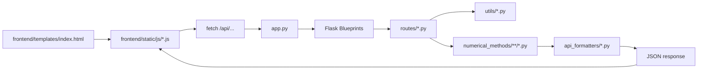

# Kiến trúc Backend và Cấu trúc Thuật toán

## 1. Mục tiêu tài liệu

Tài liệu này mô tả:

- Cấu trúc tổng thể của project.
- Kiến trúc backend Flask hiện tại.
- Luồng dữ liệu từ frontend tới backend và ngược lại.
- Cấu trúc thư mục backend theo đúng mã nguồn.
- Vai trò của từng blueprint, route, formatter, utility.
- Thuật toán trong từng module `backend/numerical_methods/*`, kèm đầu vào, đầu ra, bước xử lý và ràng buộc.

Phạm vi tài liệu bám theo mã nguồn hiện có trong project `Numerical-Calc-main`, không mô tả theo ý tưởng chung.

---

## 2. Ảnh chụp nhanh toàn project

```text
Numerical-Calc-main/
|-- app.py
|-- run.py
|-- README.md
|-- backend/
|   |-- api_formatters/
|   |-- numerical_methods/
|   |-- routes/
|   `-- utils/
`-- frontend/
    |-- templates/
    `-- static/
        |-- css/
        `-- js/
```

### Ý nghĩa từng phần

- `app.py`: entrypoint Flask, mount template/static folder và đăng ký các blueprint backend.
- `frontend/`: SPA nhẹ dạng server-rendered shell + JavaScript thuần, gọi API nội bộ `/api/...`.
- `backend/routes/`: lớp HTTP API, nhận request, validate dữ liệu, parse đầu vào, gọi thuật toán.
- `backend/numerical_methods/`: lõi tính toán số.
- `backend/api_formatters/`: chuyển kết quả thô của thuật toán thành JSON thuận tiện cho frontend.
- `backend/utils/`: hàm dùng chung để parse ma trận, parse biểu thức, LU helpers, làm sạch số nhỏ.

---

## 3. Kiến trúc tổng thể

### 3.1 Kiến trúc ở mức component



### 3.2 Kiến trúc backend theo tầng

Backend hiện tại là kiến trúc monolith Flask đơn giản, tách theo chức năng chứ không tách thành service layer độc lập:

1. `app.py`
   Mount frontend và đăng ký blueprint.
2. `routes`
   Là controller layer.
3. `utils`
   Là parse/helper layer.
4. `numerical_methods`
   Là computation layer.
5. `api_formatters`
   Là response/presentation layer cho JSON.

### 3.3 Luồng request chuẩn

1. Frontend JS gọi `fetch()` tới endpoint `/api/...`.
2. Route Flask nhận payload JSON hoặc file upload.
3. Route parse dữ liệu đầu vào:
   - Ma trận: `parse_matrix_from_string`.
   - Biểu thức: `parse_expression`, `sympify`, `lambdify`.
   - CSV: `pandas.read_csv`.
4. Route gọi hàm trong `backend/numerical_methods/...`.
5. Thuật toán trả về `dict` chứa nghiệm, bước lặp, ma trận trung gian, hệ số co, bảng sai phân...
6. Route chuyển kết quả qua `backend/api_formatters/...`.
7. Formatter biến `numpy.ndarray`, `complex`, LaTeX string, bảng bước thành JSON thân thiện với frontend.
8. Frontend render kết quả chi tiết.

---

## 4. Entry point và wiring

### 4.1 `app.py`

Vai trò:

- Tạo ứng dụng Flask.
- Cấu hình:
  - `template_folder='frontend/templates'`
  - `static_folder='frontend/static'`
- Đăng ký các blueprint:
  - `linear_algebra_bp`
  - `root_finding_bp`
  - `polynomial_bp`
  - `nonlinear_systems_bp`
  - `interpolation_bp`
  - `horner_bp`
- Route `/` render `index.html`.

Điểm đáng chú ý:

- Không dùng app factory.
- Không có config class riêng.
- Toàn bộ backend đang chạy trong một Flask app duy nhất.

### 4.2 Các file bootstrap khác

- `run.py`: file test nhanh NumPy/Cholesky, không tham gia luồng web.
- `backend/__init__.py`: rỗng.
- `backend/routes/__init__.py`: rỗng.
- `backend/utils/decorators.py`: rỗng.

---

## 5. Bản đồ backend theo thư mục

### 5.1 `backend/routes/`

| File | Prefix | Vai trò |
|---|---|---|
| `linear_algebra_routes.py` | `/api/linear-algebra` | Hệ tuyến tính, nghịch đảo, SVD, eigen |
| `root_finding_routes.py` | `/api/root-finding` | Giải `f(x)=0` |
| `polynomial_routes.py` | `/api/polynomial` | Giải đa thức |
| `nonlinear_systems_routes.py` | `/api/nonlinear-systems` | Hệ phi tuyến |
| `interpolation_routes.py` | `/api/interpolation` | Nội suy, spline, least squares, chọn mốc |
| `horner_routes.py` | `/api/horner` | Sơ đồ Horner |
| `approximation_routes.py` | `/approximation` | Blueprint render template cũ, hiện không được đăng ký trong `app.py` |

### 5.2 `backend/api_formatters/`

Nhóm này không tính toán, chỉ chuẩn hóa output:

- Chuyển `numpy.ndarray` -> `list`
- Chuyển `complex` -> object `{real, imag}` hoặc số thực nếu phần ảo gần 0
- Tạo chuỗi đa thức/LaTeX
- Tạo `message`, `status`, tên cột sai số, bảng bước phù hợp cho UI

Các file formatter bám theo domain:

- `linear_algebra.py`
- `root_finding.py`
- `nonlinear_systems.py`
- `interpolation.py`
- `horner_table.py`

### 5.3 `backend/utils/`

| File | Vai trò |
|---|---|
| `helpers.py` | Parse ma trận từ chuỗi, zero nhỏ về 0, lấy đa thức đặc trưng từ ma trận Frobenius |
| `expression_parser.py` | Parse biểu thức 1 biến bằng SymPy, tạo `f`, `f'`, `f''`, `phi`, `phi'` |
| `linalg_helpers.py` | LU có pivot cục bộ, thế tiến, thế lùi, null space |

### 5.4 `backend/numerical_methods/`

Đây là lõi thuật toán, chia thành các nhóm:

- `linear_algebra/`
  - `direct/`
  - `iterative/`
  - `inverse/`
  - `eigen/`
- `root_finding/`
- `polynomial/`
- `nonlinear_systems/`
- `interpolation/`
- `horner_table/`

---

## 6. Bản đồ endpoint

### 6.1 Đại số tuyến tính

| Endpoint | Hàm route | Thuật toán |
|---|---|---|
| `POST /api/linear-algebra/solve/gauss` | `solve_gauss` | `gauss_elimination` |
| `POST /api/linear-algebra/solve/gauss-jordan` | `solve_gauss_jordan_route` | `gauss_jordan` |
| `POST /api/linear-algebra/solve/lu` | `solve_lu_route` | `solve_lu` |
| `POST /api/linear-algebra/solve/cholesky` | `solve_cholesky_route` | `solve_cholesky` |
| `POST /api/linear-algebra/solve/jacobi` | `solve_jacobi_route` | `jacobi` |
| `POST /api/linear-algebra/solve/gauss-seidel` | `solve_gauss_seidel_route` | `gauss_seidel` |
| `POST /api/linear-algebra/solve/simple-iteration` | `solve_simple_iteration_route` | `simple_iteration` |
| `POST /api/linear-algebra/inverse/gauss-jordan` | `inverse_gauss_jordan_route` | `gauss_jordan_inverse` |
| `POST /api/linear-algebra/inverse/lu` | `inverse_lu_route` | `lu_inverse` |
| `POST /api/linear-algebra/inverse/cholesky` | `inverse_cholesky_route` | `cholesky_inverse` |
| `POST /api/linear-algebra/inverse/bordering` | `inverse_bordering_route` | `bordering_inverse` |
| `POST /api/linear-algebra/inverse/jacobi` | `inverse_jacobi_route` | `jacobi_inverse` |
| `POST /api/linear-algebra/inverse/newton` | `inverse_newton_route` | `newton_inverse` |
| `POST /api/linear-algebra/inverse/gauss-seidel` | `inverse_gauss_seidel_route` | `gauss_seidel_inverse` |
| `POST /api/linear-algebra/svd` | `svd_route` | `svd_numpy` hoặc `svd_power_deflation` |
| `POST /api/linear-algebra/eigen/danilevsky` | `danilevsky_route` | `danilevsky_algorithm` |
| `POST /api/linear-algebra/eigen/power-single` | `power_single_route` | `power_method_single` |
| `POST /api/linear-algebra/eigen/power-deflation` | `power_deflation_route` | `power_method_deflation` |
| `POST /api/linear-algebra/svd-approximation` | `svd_approximation_route` | `calculate_svd_approximation` |

### 6.2 Phương trình phi tuyến và đa thức

| Endpoint | Thuật toán |
|---|---|
| `POST /api/root-finding/solve` | Bisection / Secant / Newton / Simple Iteration |
| `POST /api/polynomial/solve` | `solve_polynomial_roots` |
| `POST /api/nonlinear-systems/solve` | Newton / Newton cải tiến / Lặp đơn cho hệ |

### 6.3 Nội suy, xấp xỉ, Horner

| Endpoint | Thuật toán |
|---|---|
| `POST /api/interpolation/chebyshev-nodes` | `chebyshev_nodes` |
| `POST /api/interpolation/lagrange` | `lagrange_interpolation` |
| `POST /api/interpolation/divided-difference` | `divided_differences` |
| `POST /api/interpolation/finite-difference` | `finite_differences` |
| `POST /api/interpolation/newton-interpolation` | `newton_interpolation_equidistant` hoặc `newton_interpolation_divided_difference` |
| `POST /api/interpolation/central-interpolation` | `central_gauss_i`, `central_gauss_ii`, `stirlin_interpolation`, `bessel_interpolation` |
| `POST /api/interpolation/spline` | `spline_linear`, `spline_quadratic`, `spline_cubic` |
| `POST /api/interpolation/least-squares` | `least_squares_approximation` |
| `POST /api/interpolation/select-nodes` | `select_interpolation_nodes` |
| `POST /api/interpolation/find-intervals` | `find_root_intervals` |
| `POST /api/interpolation/inverse-iterative` | `solve_inverse_iterative` |
| `POST /api/horner/synthetic-division` | `synthetic_division` |
| `POST /api/horner/all-derivatives` | `all_derivatives` |
| `POST /api/horner/reverse-horner` | `reverse_horner` |
| `POST /api/horner/w-function` | `calculate_w_function` |
| `POST /api/horner/change-variables` | `change_variables` |

---

## 7. Utility layer chi tiết

### 7.1 `parse_matrix_from_string`

File: `backend/utils/helpers.py`

Vai trò:

- Nhận chuỗi nhiều dòng.
- Tách từng hàng theo newline.
- Tách phần tử theo khoảng trắng.
- Ép về `float`.
- Kiểm tra số cột đồng nhất.
- Trả về `np.array`.

Được dùng bởi:

- Gần như toàn bộ route đại số tuyến tính.
- SVD/eigen/power methods.

### 7.2 `zero_small`

Vai trò:

- Ép các giá trị có trị tuyệt đối < `tol` về `0.0`.
- Làm sạch nhiễu số học trước khi trả kết quả.

Được dùng mạnh ở:

- Gauss, LU, Cholesky, Jacobi, SVD formatter, inverse methods.

### 7.3 `parse_expression`, `parse_phi_expression`, `get_derivative`

File: `backend/utils/expression_parser.py`

Vai trò:

- Dùng `sympify` để parse biểu thức một biến.
- Dùng `lambdify` sinh hàm callable bằng backend NumPy.
- Sinh sẵn `f`, `f'`, `f''`.

Được dùng cho:

- Root finding 1 biến.

### 7.4 `linalg_helpers.py`

Bao gồm:

- `lu_decomposition_partial_pivoting(A, tol)`
  - Sinh `P, L, U` sao cho `P @ A = L @ U`.
- `forward_substitution(L, B, tol)`
- `backward_substitution(U, B, tol)`
- `null_space(A, tol)`
  - Dùng SVD để lấy không gian nghiệm thuần nhất.

Được tái sử dụng trong:

- `solve_lu`
- `lu_inverse`

---

## 8. Nhóm thuật toán: Đại số tuyến tính

### 8.1 Nhóm `direct/`

#### 8.1.1 `gauss_elimination`

File: `backend/numerical_methods/linear_algebra/direct/gauss_elimination.py`

Mục tiêu:

- Giải hệ `A x = b`, kể cả trường hợp ma trận không vuông.

Đầu vào:

- `A`, `b`, `tol`

Luồng xử lý:

1. Ghép ma trận mở rộng `[A | b]`.
2. Khử xuôi theo cột:
   - Nếu pivot hiện tại nhỏ hơn `tol`, tìm hàng dưới để đổi chỗ.
   - Nếu không có pivot hợp lệ, bỏ qua cột đó.
3. Ghi log từng bước:
   - `pivot`
   - `elimination`
4. Tính `rank` theo số cột pivot.
5. Phân loại:
   - `rank < rank([A|b])` -> vô nghiệm
   - `rank < số ẩn` -> vô số nghiệm
   - ngược lại -> nghiệm duy nhất
6. Với vô số nghiệm:
   - Tạo nghiệm riêng.
   - Tạo các vector null space bằng truy hồi ngược.
7. Với nghiệm duy nhất:
   - Thế lùi theo cột pivot.

Đầu ra chính:

- `status`
- `steps`
- `solution` hoặc `particular_solution` + `null_space_vectors`

Điểm kiến trúc:

- Hỗ trợ nhiều vế phải `b`.
- Không bắt buộc `A` vuông.

#### 8.1.2 `gauss_jordan`

File: `backend/numerical_methods/linear_algebra/direct/gauss_jordan.py`

Mục tiêu:

- Đưa hệ về dạng rút gọn theo Gauss-Jordan.

Điểm khác so với Gauss:

- Chọn pivot theo ưu tiên:
  1. phần tử `+1` hoặc `-1`
  2. nếu không có thì lấy trị tuyệt đối lớn nhất còn lại
- Chuẩn hóa hàng pivot về 1.
- Khử cả phía trên và dưới cùng cột pivot.

Phân loại nghiệm:

- Vô nghiệm nếu có hàng `0 ... 0 | c`, `c != 0`
- Vô số nghiệm nếu `rank < số ẩn`
- Nghiệm duy nhất nếu đủ pivot

Đầu ra:

- `steps`
- `solution` hoặc nghiệm tổng quát

#### 8.1.3 `solve_lu`

File: `backend/numerical_methods/linear_algebra/direct/lu_decomposition.py`

Mục tiêu:

- Giải `A X = B` bằng LU.

Luồng xử lý:

1. `_lu_decomposition_steps(A, tol)`
   - Tạo log bước Doolittle không pivot để hiển thị.
2. Nếu `A` vuông:
   - Dùng `lu_decomposition_partial_pivoting`.
3. Tính:
   - `rank(A)`
   - `rank([A|B])`
4. Phân loại:
   - vô nghiệm
   - vô số nghiệm: dùng `np.linalg.lstsq` + `null_space`
   - nghiệm duy nhất:
     - nếu vuông: giải `L Y = P B`, rồi `U X = Y`
     - nếu không vuông: dùng `lstsq`

Đầu ra:

- `lu_steps`
- `decomposition: P, L, U`
- `solution` hoặc nghiệm tổng quát
- `intermediate_y`

Điểm đặc biệt:

- Tầng hiển thị và tầng tính chính tách nhau:
  - log dùng Doolittle
  - nghiệm thực tế dùng LU có pivot

#### 8.1.4 `solve_cholesky`

File: `backend/numerical_methods/linear_algebra/direct/cholesky.py`

Thực chất:

- Đây là Cholesky tam giác trên theo dạng `M = U^T U`.
- Thuật toán chạy trong `dtype=complex`, nên nếu xuất hiện `sqrt(so am)` thì phần tử của `U` được tính trong số phức thay vì đổi sang `LDL^H`.

Luồng xử lý:

1. Kiểm tra `A` vuông.
2. Nếu `A` đối xứng:
   - dùng trực tiếp `M = A`, `d = b`
3. Nếu `A` không đối xứng:
   - chuyển sang hệ chuẩn tắc:
     - `M = A^T A`
     - `d = A^T b`
4. Phân tích `M = U^T U`.
   - Tính đường chéo:
     - `u_kk = sqrt(m_kk - sum_{s<k} u_sk^2)`
   - Nếu biểu thức dưới căn âm, `u_kk` trở thành số phức.
   - Nếu biểu thức dưới căn gần 0, thuật toán dừng vì ma trận suy biến hoặc cần pivoting/permutation.
   - Tính phần tử ngoài đường chéo:
     - `u_kj = (m_kj - sum_{s<k} u_sk u_sj) / u_kk`
5. Giải lần lượt:
   - `U^T y = d`
   - `U x = y`

Đầu ra:

- `solution`
- `transformation_message`
- `decomposition: M, d, U, Ut`
- `intermediate_y`

Ý nghĩa:

- Với ma trận không đối xứng, kết quả mang ý nghĩa nghiệm của hệ chuẩn tắc hoặc least-squares hơn là phân rã trực tiếp trên `A`.
- Với ma trận đối xứng không xác định dương, `U` có thể là ma trận phức và vẫn thỏa `M = U^T U` nếu các pivot cần thiết không rơi vào 0.

---

### 8.2 Nhóm `iterative/`

#### 8.2.1 `jacobi`

File: `backend/numerical_methods/linear_algebra/iterative/jacobi.py`

Mục tiêu:

- Giải `A x = b` bằng Jacobi.

Luồng xử lý:

1. Kiểm tra `A` vuông và đường chéo không chứa 0.
2. Kiểm tra chéo trội theo hàng hoặc cột.
3. Tạo:
   - `T = diag(1/a_ii)`
   - `B = I - T A`
   - `d = T b`
4. Chọn chuẩn:
   - chéo trội hàng -> chuẩn vô cùng
   - chéo trội cột -> chuẩn 1
5. Tính hệ số co và hệ số hậu nghiệm.
6. Lặp:
   - `x(k+1) = B x(k) + d`
   - ước lượng sai số

Đầu ra:

- `solution`
- `iterations_data`
- `matrix_B`, `vector_d`
- `contraction_coefficient`

#### 8.2.2 `gauss_seidel`

File: `backend/numerical_methods/linear_algebra/iterative/gauss_seidel.py`

Mục tiêu:

- Giải `A x = b` bằng Gauss-Seidel.

Luồng xử lý:

1. Kiểm tra `A` vuông, chéo khác 0, chéo trội.
2. Tính các hệ số `q`, `s` tùy theo chuẩn hàng/cột.
3. Tính `stopping_factor = q / ((1-s)(1-q))`.
4. Lặp cập nhật từng phần tử:
   - dùng giá trị mới cho phần trước
   - dùng giá trị cũ cho phần sau

Đầu ra:

- `solution`
- `iterations_data`
- `coeff_q`, `coeff_s`

#### 8.2.3 `simple_iteration`

File: `backend/numerical_methods/linear_algebra/iterative/simple_iteration.py`

Mục tiêu:

- Giải trực tiếp dạng lặp `x = Bx + d`.

Luồng xử lý:

1. Kiểm tra kích thước `B`, `d`, `x0`.
2. Tính `||B||` theo chuẩn 1 hoặc vô cùng.
3. Nếu `||B|| >= 1`, không dừng ngay mà phát cảnh báo.
4. Nếu `||B|| < 1`, dùng ngưỡng hậu nghiệm:
   - `|(1-||B||)/||B||| * tol`
5. Lặp:
   - `x(k+1) = B x(k) + d`
   - đo `||x(k+1)-x(k)||`

Đầu ra:

- `solution`
- `iterations_data`
- `norm_B`
- `warning_message`

---

### 8.3 Nhóm `inverse/`

#### 8.3.1 `gauss_jordan_inverse`

File: `backend/numerical_methods/linear_algebra/inverse/gauss_jordan_inverse.py`

Ý tưởng:

- Giải `A X = I` bằng `gauss_jordan`.

Luồng:

1. Kiểm tra `A` vuông.
2. Tạo `I`.
3. Gọi `gauss_jordan(A, I, tol)`.
4. Nếu không ra nghiệm duy nhất -> ma trận không khả nghịch.

#### 8.3.2 `lu_inverse`

File: `backend/numerical_methods/linear_algebra/inverse/lu_inverse.py`

Ý tưởng:

- Tính nghịch đảo bằng cách giải `A x_i = e_i` cho từng cột của ma trận đơn vị.

Luồng:

1. Kiểm tra vuông và `det(A)` không gần 0.
2. LU có pivot: `P, L, U`.
3. Với từng cột:
   - `y = forward_substitution(L, P e_i)`
   - `x = backward_substitution(U, y)`
4. Ghép các cột thành `A^-1`.

Đầu ra:

- `inverse`
- `decomposition`
- `steps_solve`

#### 8.3.3 `cholesky_inverse`

File: `backend/numerical_methods/linear_algebra/inverse/cholesky_inverse.py`

Ý tưởng:

- Nếu `A` đối xứng: dùng trực tiếp Cholesky.
- Nếu không đối xứng: chuyển sang `M = A^T A`, rồi suy ra:
  - `A^-1 = (A^T A)^-1 A^T`

Luồng:

1. Kiểm tra vuông.
2. Xác định `is_symmetric`.
3. Kiểm tra xác định dương của `M` qua trị riêng.
4. Tự xây dựng tam giác trên `U`.
5. Tính:
   - `U^-1`
   - `M^-1 = U^-1 (U^-1)^T`
6. Nếu cần, nhân thêm `A^T`.

#### 8.3.4 `bordering_inverse`

File: `backend/numerical_methods/linear_algebra/inverse/bordering.py`

Ý tưởng:

- Xây nghịch đảo tăng dần theo cấp ma trận con:
  - từ `A_1^-1`
  - sang `A_2^-1`
  - ...
  - đến `A_n^-1`

Luồng mỗi bước:

1. Tách:
   - `u_k`
   - `v_k^T`
   - `a_kk`
2. Tính:
   - `theta_k = a_kk - v_k^T A_k^-1 u_k`
3. Dùng công thức khối để sinh ma trận nghịch đảo cấp `k+1`.

Đầu ra:

- `inverse`
- `check = A @ inverse`
- `steps`

#### 8.3.5 `jacobi_inverse`

File: `backend/numerical_methods/linear_algebra/inverse/jacobi_inverse.py`

Ý tưởng:

- Tái sử dụng `jacobi` để giải `A X = I`.

Khởi tạo:

- `method1`: `X0 = A^T / ||A||_2^2`
- `method2`: `X0 = A^T / (||A||_1 ||A||_∞)`

Đầu ra:

- `inverse`
- `check_matrix`
- `initial_matrix`
- dữ liệu lặp Jacobi

#### 8.3.6 `newton_inverse`

File: `backend/numerical_methods/linear_algebra/inverse/newton_inverse.py`

Ý tưởng:

- Lặp Newton-Schulz:
  - `X(k+1) = X(k) (2I - A X(k))`

Luồng:

1. Kiểm tra vuông và khả nghịch.
2. Tạo hai ứng viên `X0`.
3. Tính `q = ||I - A X0||_2`.
4. Chọn `X0` theo `x0_method` hoặc phương án tốt hơn.
5. Nếu `q >= 1` -> không đảm bảo hội tụ.
6. Lặp Newton đến khi sai số hậu nghiệm nhỏ hơn `tol`.

Đầu ra:

- `inverse`
- `iterations_data`
- `contraction_coefficient`
- `check_matrix`

#### 8.3.7 `gauss_seidel_inverse`

File: `backend/numerical_methods/linear_algebra/inverse/gauss_seidel_inverse.py`

Ý tưởng:

- Tái sử dụng `gauss_seidel` để giải `A X = I`.

Giống `jacobi_inverse`, chỉ khác bộ solver bên trong.

---

### 8.4 Nhóm `eigen/`

#### 8.4.1 `svd_numpy`

File: `backend/numerical_methods/linear_algebra/eigen/svd.py`

Ý tưởng:

- Gọi trực tiếp `np.linalg.svd(A, full_matrices=False)`.

Đầu ra:

- `U`
- `Sigma_diag`
- `Vt`

#### 8.4.2 `svd_power_deflation`

Ý tưởng:

- Tính SVD bằng trị riêng trên:
  - `A^T A` nếu `m >= n`
  - `A A^T` nếu `m < n`
- Dùng power method để tìm trị riêng lớn nhất.
- Deflation để tìm tiếp các thành phần còn lại.

Luồng:

1. Chọn ma trận làm việc.
2. Với từng singular value cần tìm:
   - khởi tạo vector
   - lặp power method
   - lấy `lambda`
   - `sigma = sqrt(lambda)`
   - deflate ma trận làm việc
3. Khôi phục `U`, `V` từ các vector riêng và singular values.

Đầu ra:

- `U`, `Sigma_diag`, `Vt`
- `intermediate_steps`

#### 8.4.3 `calculate_svd_approximation`

Ý tưởng:

- Dùng SVD chuẩn rồi cắt bớt singular values theo 3 chế độ:
  - `rank-k`
  - `threshold`
  - `error-bound`

Luồng:

1. `U, s, Vt = svd(A)`.
2. Xác định `k`.
3. Tạo `A_approx = U_k Σ_k V_k^T`.
4. Tính:
   - ma trận sai số
   - sai số tuyệt đối
   - sai số tương đối
   - tỷ lệ năng lượng giữ lại

Đầu ra:

- `approximated_matrix`
- `error_matrix`
- `effective_rank`
- `retained_components`
- `discarded_components`

#### 8.4.4 `danilevsky_algorithm`

File: `backend/numerical_methods/linear_algebra/eigen/danilevsky.py`

Ý tưởng:

- Biến đổi tương tự đưa ma trận về dạng Frobenius theo khối.

Luồng:

1. Khởi tạo `similar = A`, `back = I`.
2. Với `k` từ `n-1` về `1`:
   - nếu `similar[k, k-1]` gần 0 thì coi như tách block
   - tạo ma trận biến đổi `M`
   - tính `M^-1`
   - cập nhật:
     - `similar = M A M^-1`
     - `back = back M^-1`
3. Tìm biên block.
4. Với mỗi block Frobenius:
   - lấy đa thức đặc trưng bằng `get_char_polynomial`
   - tính nghiệm đa thức
   - dựng vector riêng trong không gian Frobenius
   - kéo ngược về không gian gốc bằng `back`

Đầu ra:

- `eigenvalues`
- `eigenvectors`
- `frobenius_matrix`
- `char_poly`
- `steps`

#### 8.4.5 `power_method_single`

Ý tưởng:

- Tìm trị riêng trội và vector riêng tương ứng.

Luồng:

1. Chuẩn hóa `x0`.
2. Lặp:
   - `Ax`
   - chuẩn hóa thành `x_new`
   - Rayleigh quotient cho `lambda_new`
3. Dừng khi `|lambda_new - lambda_old| < tol`.

#### 8.4.6 `power_method_deflation`

Ý tưởng:

- Gọi nhiều lần `power_method_single`.
- Sau mỗi nghiệm, deflation kiểu Hotelling:
  - `A <- A - lambda * v v^T`

Điểm thêm:

- Có một đoạn inverse iteration ngắn để tinh chỉnh vector riêng cho ma trận gốc.

Đầu ra:

- `eigen_pairs`
- `steps`

---

## 9. Nhóm thuật toán: Giải `f(x)=0`

### 9.1 `bisection_method`

File: `backend/numerical_methods/root_finding/bisection.py`

Ý tưởng:

- Chia đôi khoảng cách ly nghiệm `[a, b]`.

Luồng:

1. Kiểm tra `f(a) * f(b) < 0`.
2. Có bước kiểm tra đơn điệu xấp xỉ bằng đạo hàm sai phân trung tâm, nhưng chỉ dùng như cảnh báo mềm.
3. Nếu `mode == iterations`, chạy đúng số vòng lặp yêu cầu.
4. Nếu dừng theo sai số:
   - tính `c = (a+b)/2`
   - `error = |c - c_prev|`
   - `relative_error = error / |c|`
5. Cập nhật nửa khoảng chứa nghiệm.

Đầu ra:

- `solution`
- `steps`
- `iterations`

### 9.2 `secant_method`

File: `backend/numerical_methods/root_finding/secant.py`

Ý tưởng:

- Dùng một điểm cố định Fourier `d` và một điểm lặp `x_n`.

Luồng:

1. Kiểm tra cách ly nghiệm và dấu của `f'`, `f''`.
2. Chọn điểm Fourier:
   - ưu tiên `a` nếu `f(a)f''(a) > 0`
   - nếu không thì xét `b`
3. Tính các hằng:
   - `m1 = min |f'|`
   - `M1 = max |f'|`
4. Lặp công thức dây cung với `d` cố định.
5. Sai số hậu nghiệm tùy `stop_condition`:
   - theo `f(x_n)`
   - hoặc theo `|x_n - x_{n-1}|`

Đầu ra:

- `solution`
- `steps`
- `m1`, `M1`, `d`, `x0`

### 9.3 `newton_method`

File: `backend/numerical_methods/root_finding/newton.py`

Ý tưởng:

- Newton một biến với kiểm tra điều kiện hội tụ khá chặt.

Luồng:

1. Kiểm tra `f'`, `f''` không đổi dấu trên `[a, b]`.
2. Tính:
   - `m1 = min |f'|`
   - `M2 = max |f''|`
3. Lặp:
   - `x_{k+1} = x_k - f(x_k)/f'(x_k)`
4. Ép `x_{k+1}` phải nằm trong `[a, b]`.
5. Tính sai số hậu nghiệm theo:
   - `|f(x_{k+1})|/m1`
   - hoặc `(M2/(2m1)) |x_{k+1}-x_k|^2`

Đầu ra:

- `solution`
- `steps`
- `m1`, `M2`, `x0`

### 9.4 `simple_iteration_method`

File: `backend/numerical_methods/root_finding/simple_iteration.py`

Ý tưởng:

- Giải `x = phi(x)`.

Luồng:

1. Xét `f(x) = phi(x) - x`.
2. Kiểm tra khoảng cách ly nghiệm bằng dấu của `f(a), f(b)`.
3. Tính `q = max |phi'(x)|` trên `[a, b]`.
4. Nếu `q >= 1` -> báo không hội tụ.
5. Lặp:
   - `x_{k+1} = phi(x_k)`
   - `error = q/(1-q) * |x_{k+1} - x_k|`
6. Ép điểm lặp phải nằm trong khoảng.

Đầu ra:

- `solution`
- `steps`
- `q`
- `x0`

---

## 10. Nhóm thuật toán: Đa thức

### 10.1 `solve_polynomial_roots`

File: `backend/numerical_methods/polynomial/solve.py`

Ý tưởng:

- Tự động phân ly nghiệm thực qua các khoảng đơn điệu, sau đó dùng chia đôi.

Luồng:

1. Tạo đa thức `p = np.poly1d(coeffs)` và đạo hàm `p'`.
2. Dùng `_find_root_bounds(coeffs)`:
   - cận trên nghiệm dương theo kiểu Lagrange
   - cận dưới nghiệm âm thông qua biến đổi dấu hệ số lẻ
3. Tìm các điểm tới hạn thực từ nghiệm của `p'`.
4. Tạo các khoảng tìm kiếm:
   - `[lower_bound, cp_1]`
   - `[cp_1, cp_2]`
   - ...
   - `[cp_k, upper_bound]`
5. Trong mỗi khoảng, nếu đa thức đổi dấu thì gọi `_bisection`.
6. Loại nghiệm trùng gần nhau bằng `np.isclose`.

Đầu ra:

- `polynomial_str`
- `bounds`
- `critical_points`
- `search_intervals`
- `found_roots`

Điểm hay:

- Không cần người dùng tự chia khoảng nghiệm.

---

## 11. Nhóm thuật toán: Hệ phi tuyến

### 11.1 `solve_newton_system`

File: `backend/numerical_methods/nonlinear_systems/newton.py`

Ý tưởng:

- Newton cho hệ `F(X) = 0`.

Luồng:

1. Tạo biến `x1, x2, ..., xn`.
2. Parse `expr_list` thành ma trận cột `F`.
3. Tạo Jacobian symbolic `J = F.jacobian(variables)`.
4. Mỗi bước:
   - thế `X_k` vào `F` và `J`
   - kiểm tra `det(J)` không gần 0
   - giải `delta_X = J^-1 F`
   - cập nhật `X = X - delta_X`
5. Nếu dừng theo sai số:
   - tính chuẩn 1 hoặc vô cùng của `X_k - X_{k-1}`
   - tính sai số tương đối

Đầu ra:

- `solution`
- `steps`
- `jacobian_matrix_latex`

### 11.2 `solve_newton_modified_system`

File: `backend/numerical_methods/nonlinear_systems/newton_modified.py`

Khác biệt với Newton chuẩn:

- Chỉ tính `J(X0)^-1` một lần.
- Mỗi vòng lặp dùng lại ma trận nghịch đảo ban đầu:
  - `X <- X - J0_inv * F(X)`

Ưu điểm:

- Rẻ hơn mỗi vòng.

Nhược điểm:

- Có thể hội tụ chậm hoặc kém ổn định hơn Newton chuẩn.

### 11.3 `solve_simple_iteration_system`

File: `backend/numerical_methods/nonlinear_systems/simple_iteration.py`

Ý tưởng:

- Giải `X = phi(X)` trên miền hộp `D`.

Luồng:

1. Parse `phi(X)` và Jacobian `J`.
2. Với từng đạo hàm riêng `d phi_i / d x_j`:
   - tạo hàm số NumPy
   - xấp xỉ GTLN trị tuyệt đối trên miền hộp bằng:
     - midpoint
     - grid nếu số chiều nhỏ
     - corners nếu số chiều vừa
     - random sampling có seed cố định
3. Tạo ma trận cận trên `J_max_vals`.
4. Tính:
   - tổng dòng lớn nhất
   - tổng cột lớn nhất
   - chọn chuẩn tốt hơn
   - hệ số co `K`
5. Nếu `K >= 1` -> không đảm bảo hội tụ.
6. Lặp:
   - `X_{k+1} = phi(X_k)`
   - tính sai số tuyệt đối hoặc tương đối
   - dùng ngưỡng tiên nghiệm `tol * (1-K)/K` cho sai số tuyệt đối

Đầu ra:

- `solution`
- `steps`
- `J_max_vals`
- `contraction_factor_K`
- `norm_used_for_K`

Điểm đặc biệt:

- Đây là module kiểm tra điều kiện co khá rõ ràng và có dữ liệu trung gian tốt cho giảng dạy.

---

## 12. Nhóm thuật toán: Nội suy và xấp xỉ

### 12.1 `chebyshev_nodes`

File: `backend/numerical_methods/interpolation/chebyshev_nodes.py`

Ý tưởng:

- Tạo các mốc Chebyshev trên `[a, b]` bằng phép co giãn từ `[-1,1]`.

Công thức:

- `cos((2i+1)pi / (2n))`
- rồi scale sang `[a, b]`

Đầu ra:

- danh sách `nodes` đã sort tăng dần

### 12.2 `lagrange_interpolation`

File: `backend/numerical_methods/interpolation/lagrange.py`

Ý tưởng:

- Dựng đa thức Lagrange thông qua đa thức omega `w(x)` và phép chia Horner.

Luồng:

1. Kiểm tra `x_i` phân biệt.
2. Gọi `calculate_w_function(x_nodes)` để có:
   - `w(x) = Π(x - x_i)`
3. Với từng `x_i`:
   - chia `w(x)` cho `(x - x_i)` bằng `synthetic_division`
   - tính `D_i = w'(x_i)` bằng `all_derivatives(..., order=1)`
   - dựng hạng tử:
     - `y_i / D_i * w(x)/(x-x_i)`
4. Cộng các hạng tử để ra đa thức nội suy.

Đầu ra:

- `polynomial_coeffs`
- toàn bộ bước tính `w(x)`, `D_i`, từng hạng tử

### 12.3 `divided_differences`

File: `backend/numerical_methods/interpolation/divided_difference.py`

Ý tưởng:

- Lập bảng tỷ sai phân.

Luồng:

1. Cột 0: `x_i`
2. Cột 1: `y_i`
3. Các cột sau:
   - `f[x_i,...,x_j] = (cột trước chênh nhau) / (x_i - x_j)`

Đầu ra:

- `divided_difference_table`

### 12.4 `finite_differences`

File: `backend/numerical_methods/interpolation/finite_difference.py`

Ý tưởng:

- Lập bảng sai phân cho mốc cách đều.

Luồng:

1. Kiểm tra khoảng cách `h` đều.
2. Cột 0: `x_i`
3. Cột 1: `y_i`
4. Các cột sau:
   - sai phân bậc cao hơn là hiệu của cột trước

Đầu ra:

- `finite_difference_table`

### 12.5 `newton_interpolation_equidistant`

File: `backend/numerical_methods/interpolation/newton.py`

Ý tưởng:

- Xây Newton tiến và Newton lùi cho mốc cách đều.

Luồng:

1. Lập bảng sai phân.
2. Lấy:
   - đường chéo chính cho Newton tiến
   - hàng cuối cho Newton lùi
3. Đổi biến:
   - `t = (x - x0)/h`
4. Dùng `reverse_horner` để dựng các đa thức tích `w_i(t)`.
5. Chia sai phân cho giai thừa.
6. Nhân hệ số với bảng `w_i(t)` để ra đa thức theo `t`.
7. Dùng `change_variables` để đổi lại từ `t` về `x`.

Đầu ra:

- `finite_difference_table`
- `forward_interpolation`
- `backward_interpolation`

### 12.6 `newton_interpolation_divided_difference`

Ý tưởng:

- Newton cho mốc bất kỳ.

Luồng:

1. Sort các mốc theo `x`.
2. Lập bảng tỷ sai phân.
3. Lấy:
   - đường chéo cho Newton tiến
   - hàng cuối cho Newton lùi
4. Dùng `reverse_horner` dựng các tích `w_i(x)`.
5. Nhân trực tiếp hệ số tỷ sai phân với bảng `w_i(x)`.

Đầu ra:

- `divided_difference_table`
- `forward_interpolation`
- `backward_interpolation`

### 12.7 `central_gauss_i`

File: `backend/numerical_methods/interpolation/central.py`

Ý tưởng:

- Nội suy trung tâm Gauss I cho số mốc lẻ.
- Chọn mốc trung tâm rồi nạp bên phải trước, xen kẽ trái/phải.

Luồng:

1. Kiểm tra số mốc lẻ, cách đều.
2. Lập bảng sai phân.
3. Trích dãy sai phân trung tâm theo pattern Gauss I.
4. Đổi biến `t = (x - x_mid)/h`.
5. Dùng `reverse_horner` dựng bảng tích `w_i(t)`.
6. Chia hệ số cho `i!`.
7. Sinh đa thức theo `t`, rồi đổi sang `x`.

### 12.8 `central_gauss_ii`

Ý tưởng:

- Tương tự Gauss I nhưng nạp bên trái trước.

Khác biệt:

- Cách trích sai phân trung tâm và thứ tự dựng `w_i(t)`.

### 12.9 `stirlin_interpolation`

Ý tưởng:

- Lấy trung bình dữ liệu của Gauss I và Gauss II.
- Phù hợp cho số mốc lẻ.

Luồng:

1. Tính các dãy sai phân trung tâm của Gauss I và II.
2. Lấy trung bình từng bậc.
3. Dựng đa thức chẵn và lẻ riêng trên biến `t`.
4. Ghép lại thành đa thức Stirling.

### 12.10 `bessel_interpolation`

Ý tưởng:

- Nội suy Bessel cho số mốc chẵn.
- Xuất phát từ hai mốc giữa.

Luồng:

1. Lấy dữ liệu trung tâm từ Gauss I và II rồi trung bình.
2. Dùng biến:
   - `t = (x - x0)/h`
   - `u = t - 0.5`
3. Dựng bảng tích theo `u^2`.
4. Tạo đa thức chẵn/lẻ trong `u`.
5. Đổi ngược từ `u -> t -> x`.

---

### 12.11 `spline_linear`

File: `backend/numerical_methods/interpolation/spline.py`

Ý tưởng:

- Mỗi đoạn `[x_k, x_{k+1}]` dùng đường thẳng:
  - `S_k(x) = a_k x + b_k`

Tính:

- `a_k = (y_{k+1} - y_k)/h_k`
- `b_k = (y_k x_{k+1} - y_{k+1} x_k)/h_k`

### 12.12 `spline_quadratic`

Ý tưởng:

- Spline bậc 2, liên tục cấp 1.

Luồng:

1. Dùng ẩn `m_i = S'(x_i)`.
2. Điều kiện:
   - `m_k + m_{k+1} = 2(y_{k+1} - y_k)/h_k`
3. Gắn điều kiện biên đầu:
   - `m_1 = boundary_m1`
4. Tính đệ quy toàn bộ `m_i`.
5. Từ `m_i`, dựng từng tam thức bậc 2.

Đầu ra:

- `m_values`
- `gammas`
- `splines`

### 12.13 `spline_cubic`

Ý tưởng:

- Spline bậc 3 với điều kiện biên theo đạo hàm bậc hai ở hai đầu.

Luồng:

1. Đặt `alpha_i = S''(x_i)`.
2. Lập hệ tam đường chéo cho các `alpha` nội bộ:
   - dùng `h_k`
   - dùng `gamma_k`
3. Chèn điều kiện biên:
   - `alpha_0`
   - `alpha_{n-1}`
4. Giải hệ bằng `np.linalg.solve`.
5. Với mỗi đoạn:
   - dựng spline cục bộ theo biến dịch `x - x_k`
   - hệ số `[a_k, b_k, c_k, d_k]`

Đầu ra:

- `alpha_values`
- `splines`
- `intermediate_system: M, R`

### 12.14 `least_squares_approximation`

File: `backend/numerical_methods/interpolation/least_squares.py`

Ý tưởng:

- Xấp xỉ `g(x) = Σ a_j φ_j(x)` theo bình phương tối thiểu.

Luồng:

1. Parse các hàm cơ sở `φ_j(x)` bằng SymPy.
2. Tạo ma trận thiết kế `Phi[i, j] = φ_j(x_i)`.
3. Lập hệ chuẩn:
   - `M = Phi^T Phi`
   - `rhs = Phi^T y`
4. Giải `M a = rhs`.
5. Tính:
   - `y_pred`
   - residuals
   - SSE
   - sai số chuẩn

Đầu ra:

- `coefficients`
- `g_x_str_latex`
- `intermediate_matrices`
- `error_metrics`

### 12.15 `select_interpolation_nodes`

File: `backend/numerical_methods/interpolation/node_selection.py`

Ý tưởng:

- Đọc CSV, chọn `k` mốc quanh `x_bar`.

Luồng:

1. `pandas.read_csv`.
2. Ép numeric, loại NaN, sort theo `x`.
3. Nếu `x` trùng:
   - giữ phần tử đầu tiên
   - sinh `warning_message`
4. Chọn mốc theo `method`:
   - `right`: phù hợp Newton tiến
   - `left`: phù hợp Newton lùi
   - `both`: cân bằng quanh `x_bar`

Đầu ra:

- `selected_x`
- `selected_y`
- `warning_message`

### 12.16 `find_root_intervals`

File: `backend/numerical_methods/interpolation/find_intervals.py`

Ý tưởng:

- Từ dữ liệu bảng `(x, y)`, tìm các khoảng có khả năng chứa nghiệm của `f(x) = y_bar`.

Luồng:

1. Đọc CSV và sort.
2. Tạo:
   - `diff = y - y_bar`
   - `sign = sign(diff)` và xử lý trường hợp 0 bằng ffill/bfill
3. Tìm vị trí đổi dấu liên tiếp.
4. Với mỗi khoảng gốc `[i, i+1]`, mở rộng sang trái/phải mà vẫn giữ cấu trúc một khoảng cách ly.
5. Không để trùng interval đã tìm.

Đầu ra:

- danh sách `intervals`
- mỗi interval chứa:
  - `selected_x`, `selected_y`
  - `original_interval`

### 12.17 `solve_inverse_iterative`

File: `backend/numerical_methods/interpolation/inverse_interpolation.py`

Ý tưởng:

- Giải bài toán ngược `f(x) = y_bar` bằng lặp trên biến `t` của Newton tiến/lùi.

Luồng:

1. Sort mốc và kiểm tra cách đều.
2. Lập bảng sai phân.
3. Tùy `method`:
   - `forward`: dùng `x0`, `y0`, `Δy0`, `Δ^2y0`, ...
   - `backward`: dùng `xn`, `yn`, `∇yn`, `∇^2yn`, ...
4. Tạo `t0 = (y_bar - y_start)/sai_phan_bac_1`.
5. Xây dựng hàm lặp `phi_forward(t)` hoặc `phi_backward(t)`.
6. Lặp cho đến khi `|t_{k+1}-t_k| < epsilon`.
7. Khôi phục:
   - `x_final = x_start + t_final * h`

Đầu ra:

- `t_final`
- `x_final`
- `iteration_table`
- `finite_difference_table`

---

## 13. Nhóm thuật toán: Sơ đồ Horner

### 13.1 `synthetic_division`

File: `backend/numerical_methods/horner_table/synthetic_division.py`

Ý tưởng:

- Chia đa thức `P(x)` cho `(x - c)` bằng sơ đồ Horner.

Luồng:

1. Tạo bảng `3 x n`.
2. Hàng 0: hệ số gốc.
3. Hàng 1: tích trung gian với `root`.
4. Hàng 2: cộng dồn để tạo hệ số thương.

Đầu ra:

- `division_table`
- `quotient_coeffs`
- `value = P(root)`

### 13.2 `all_derivatives`

File: `backend/numerical_methods/horner_table/all_derivatives.py`

Ý tưởng:

- Lặp chia Horner nhiều lần để lấy:
  - `P(c)`
  - `P'(c)`
  - `P''(c)`
  - ...

Luồng:

1. Dùng `synthetic_division` trên đa thức hiện tại.
2. Lấy remainder.
3. Nhân với `n!` để ra đạo hàm bậc `n`.
4. Lấy thương làm đa thức cho bước kế tiếp.

Đầu ra:

- `steps`
- `values`
- `derivatives`

### 13.3 `reverse_horner`

File: `backend/numerical_methods/horner_table/reverse_horner.py`

Ý tưởng:

- Nhân `P(x)` với `(x - c)` bằng bảng Horner ngược.

Đầu ra:

- `reverse_table`
- `coeffs` của đa thức mới

### 13.4 `calculate_w_function`

File: `backend/numerical_methods/horner_table/w_function.py`

Ý tưởng:

- Dựng:
  - `w(x) = (x-x0)(x-x1)...(x-xn)`

Luồng:

1. Bắt đầu từ `w0(x)=1`.
2. Với mỗi nghiệm `x_i`, gọi `reverse_horner(current_coeffs, x_i)`.

Đầu ra:

- `steps`
- `final_coeffs`

### 13.5 `change_variables`

File: `backend/numerical_methods/horner_table/change_variables.py`

Ý tưởng:

- Đổi biến `t = a x + b`, chuyển `P(x)` thành `Q(t)`.

Luồng:

1. Tính:
   - `x0 = -b/a`
   - `a' = 1/a`
2. Chia Horner lặp tại `x0` để thu hệ số kiểu Taylor.
3. Điều chỉnh hệ số theo lũy thừa của `a'`.
4. Đảo thứ tự hệ số để ra đa thức theo `t`.

Đầu ra:

- `steps`
- `variables_coeffs`

Điểm quan trọng:

- Module này được tái dùng mạnh trong Newton cách đều và các nội suy trung tâm.

---

## 14. Quan hệ tái sử dụng giữa các thuật toán

Đây là một trong những điểm thiết kế tốt nhất của backend hiện tại: nhiều thuật toán được lắp từ các khối nhỏ hơn.

### 14.1 Tái sử dụng trong Horner và nội suy

- `synthetic_division`
  - dùng bởi `all_derivatives`
  - dùng bởi `change_variables`
  - dùng bởi `lagrange_interpolation`
- `reverse_horner`
  - dùng bởi `calculate_w_function`
  - dùng bởi Newton nội suy
  - dùng bởi Gauss I, Gauss II, Stirling, Bessel
- `all_derivatives`
  - dùng bởi `lagrange_interpolation` để lấy `D_i = w'(x_i)`
- `change_variables`
  - dùng bởi Newton cách đều
  - dùng bởi Gauss I, II, Stirling, Bessel
- `finite_differences`
  - dùng bởi Newton cách đều
  - dùng bởi toàn bộ nhóm trung tâm
  - dùng bởi nội suy ngược lặp
- `divided_differences`
  - dùng bởi Newton mốc bất kỳ

### 14.2 Tái sử dụng trong đại số tuyến tính

- `gauss_jordan`
  - được dùng lại bởi `gauss_jordan_inverse`
- `jacobi`
  - được dùng lại bởi `jacobi_inverse`
- `gauss_seidel`
  - được dùng lại bởi `gauss_seidel_inverse`
- `lu_decomposition_partial_pivoting`
  - dùng trong `solve_lu`
  - dùng trong `lu_inverse`
- `forward_substitution`, `backward_substitution`
  - dùng trong `solve_lu`
  - dùng trong `lu_inverse`

---

## 15. Vai trò của `api_formatters`

`api_formatters` là lớp trình bày kết quả. Đây là lý do frontend không cần hiểu logic NumPy/SymPy.

### Các nhiệm vụ chính

- Chuẩn hóa output JSON:
  - `status`
  - `method`
  - `message`
  - `steps`
- Tạo chuỗi đa thức:
  - `polynomial_str`
  - `w_poly_str`
  - `taylor_str`
- Gắn thêm metadata phục vụ UI:
  - `error_col_name`
  - `extra_info`
  - LaTeX formula
  - matrix/table theo cấu trúc dễ render

### Ý nghĩa kiến trúc

- Route không phải biết UI render thế nào.
- Thuật toán không phải lo convert sang JSON.
- Dữ liệu trung gian được giữ lại rất nhiều để phù hợp ứng dụng học tập.

---

## 16. Liên kết frontend-backend

Frontend hiện tại là một shell HTML duy nhất.

### Thành phần chính

- `frontend/templates/index.html`
  - chứa toàn bộ template của các màn hình
- `frontend/static/js/main.js`
  - điều hướng nội bộ, nạp handler
- `frontend/static/js/api.js`
  - adapter gọi backend API
- `frontend/static/js/handlers/*.js`
  - bắt sự kiện từng màn hình

### Mô hình hoạt động

1. `index.html` render toàn bộ khung.
2. `main.js` thay nội dung `main-content` bằng các template ẩn.
3. Handler thu thập input.
4. `api.js` gọi đúng endpoint backend.
5. JSON response được render ra bảng, công thức, từng bước.

---

## 17. Các đặc điểm kiến trúc nổi bật

### 17.1 Điểm mạnh

- Tách rõ route, thuật toán, formatter, utility.
- Có tính tái sử dụng tốt giữa các module.
- Hầu hết thuật toán đều trả về bước trung gian đầy đủ, rất phù hợp cho dạy/học.
- Input matrix/expression được chuẩn hóa qua parser dùng chung.
- Có cả nhóm thuật toán trực tiếp, lặp, nội suy, nghịch đảo, eigen, SVD.

### 17.2 Giới hạn hiện tại

- Chưa có service layer riêng, route đang gọi thuật toán trực tiếp.
- Chưa có app factory/config package.
- Chưa có test suite backend bài bản.
- Một số file phụ trợ tồn tại nhưng chưa tham gia app:
  - `backend/routes/approximation_routes.py`
- Một số module rỗng:
  - `backend/__init__.py`
  - `backend/routes/__init__.py`
  - `backend/utils/decorators.py`

### 17.3 Kiểu kiến trúc phù hợp để gọi tên

Có thể mô tả backend này là:

- `Flask monolith`
- `function-oriented numerical backend`
- `controller -> algorithm -> formatter architecture`

Nó chưa phải layered enterprise app, nhưng lại rất phù hợp cho một hệ thống máy tính giải tích số có giao diện học tập.

---

## 18. Kết luận ngắn

Backend của project được tổ chức theo domain thuật toán, không theo database/service/model truyền thống. Trọng tâm thiết kế nằm ở:

- kiểm tra đầu vào,
- tính toán số học,
- lưu toàn bộ bước trung gian,
- và format kết quả để frontend giải thích được cho người học.

Nếu nhìn theo dependency chain, lõi thật sự của project nằm ở `backend/numerical_methods`, còn `routes` là lớp điều phối và `api_formatters` là lớp trình bày.

Nếu cần tiếp tục mở rộng project, hai hướng tốt nhất là:

1. thêm test cho từng module thuật toán,
2. chuẩn hóa contract giữa `route -> numerical_methods -> formatter` thành schema chung.
